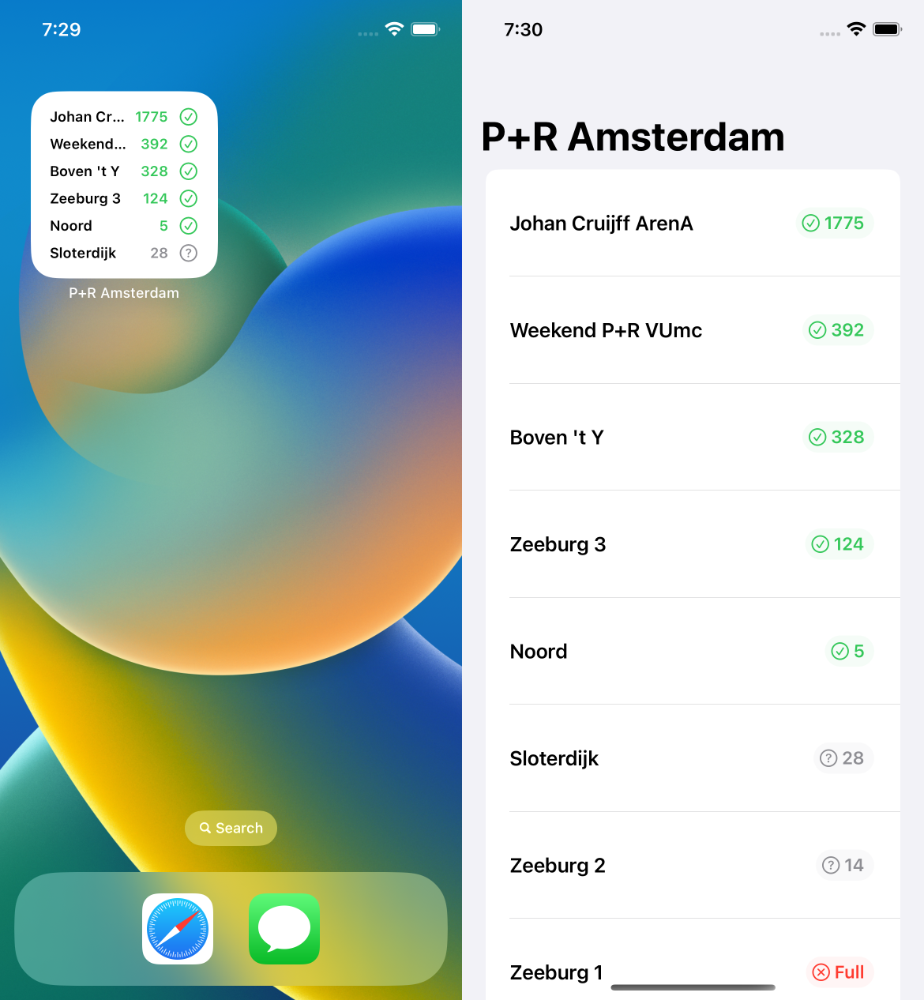

# P+R Amsterdam

Add a widget to your home screen and follow in real-time P+R Amsterdam parking availability.

P+R Amsterdam is a little experiment that I've created to learn SwiftUI. It simply reads data from [P+R availability in Amsterdam](https://www.amsterdam.nl/parkeren-verkeer/parkeren-reizen/) and outputs data into a list both in an app format and an iOS widget.

Download on [AppStore](https://apps.apple.com/us/app/p-r-amsterdam/id1643429046)
